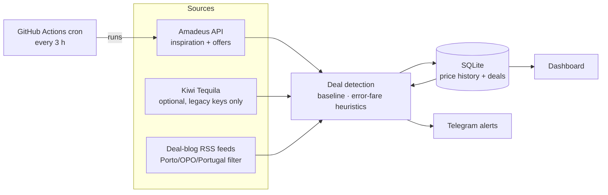

# ✈️ Porto Flight Deals

A personal flight-deal finder for departures from **Porto (OPO)** — or any
airports you configure. It combines live fare data with deal-blog RSS feeds,
learns what "normal" prices look like per route, flags price drops and
suspected **error fares**, sends **Telegram alerts**, and shows everything on
a local **dashboard**. Scheduled checks run for free on GitHub Actions.


## How it works



Every check run:

1. **Collects** fares — a broad "cheapest anywhere from OPO" search plus
   concrete quotes (economy *and* business) for your watchlist routes — and
   any new RSS posts mentioning your keywords. Every fare seen is stored, so
   a per-route price baseline builds up over time.
2. **Detects** deals against that baseline:
   - **Price drop** — fare ≥ 40 % (configurable) below the route's trailing
     90-day average. Activates once a route has 5+ observations.
   - **Error fare** — price ≤ 15 % of baseline (decimal/currency slips),
     ≥ 3 σ below the average (outliers on stable routes), or business/first
     priced ≤ 1.4× economy.
   - **Blog find** — every new matching RSS post, no price scoring.
3. **Alerts** via Telegram with route, price, dates, source link, and *why*
   it was flagged — with a cooldown so the same deal doesn't repeat every run.

## Quick start (local)

```bash
git clone <this repo> && cd <this repo>
python3 -m venv .venv && source .venv/bin/activate
pip install -r requirements.txt

cp .env.example .env     # then fill in your keys (sections below)

python -m flightdeals.run --dry-run   # one check, alerts printed not sent
python -m flightdeals.dashboard       # dashboard at http://127.0.0.1:8000
```

No keys yet? Everything still runs: RSS collection works without any
credentials, and Amadeus/Telegram simply switch off until configured.
To preview the dashboard with realistic fake data:

```bash
python scripts/seed_demo.py
FLIGHTDEALS_DB=data/demo.db python -m flightdeals.dashboard
```

## Getting the API keys

### Amadeus (flight prices — free)

1. Create an account at [developers.amadeus.com](https://developers.amadeus.com).
2. *My Self-Service Workspace → Create new app* → copy the **API Key** →
   `AMADEUS_CLIENT_ID` and **API Secret** → `AMADEUS_CLIENT_SECRET` in `.env`.
3. New apps start in the **test** environment: free, but it serves limited
   cached data and small airports like OPO can return sparse or empty
   results. That's fine for trying the pipeline. For real fares, request
   **production keys** for the app (still includes a free monthly request
   quota) and set `api.amadeus.environment: production` in `config.yaml`.

**Quota math** with the defaults (1 origin, every 3 h = ~240 runs/month):
each run makes ~1 inspiration call + 3 watchlist routes × 2 cabins = **~7
calls, ≈ 1 700/month**, inside the free tier. Tune
`max_offer_calls_per_run`, `premium_cabin_check`, and the cron frequency if
you change origins or watchlist size. Identical requests within
`cache_ttl_minutes` are served from a local cache and cost nothing.

### Kiwi.com Tequila (optional)

Tequila **closed to new sign-ups in 2023**. If you have a legacy key, set
`KIWI_API_KEY` in `.env` and `api.kiwi.enabled: true` in `config.yaml`.
Otherwise ignore it — the collector stays off. (The pluggable collector
interface in `flightdeals/collectors/base.py` makes it easy to add another
source such as Travelpayouts later.)

### Telegram bot (alerts)

1. In Telegram, message **@BotFather** → `/newbot` → pick a name and
   username → copy the token into `.env` as `TELEGRAM_BOT_TOKEN`.
2. Send any message to your new bot (it can't message you first).
3. Run `python -m flightdeals.alerts --get-chat-id` and put the printed id
   in `.env` as `TELEGRAM_CHAT_ID`.
4. Verify with `python -m flightdeals.alerts --test-message`.

## Deployment: scheduled checks on GitHub Actions

The included workflow `.github/workflows/check-deals.yml` runs a check
every 3 hours and **commits the updated SQLite database back to the repo**,
so price history persists between runs with zero infrastructure.

1. Push this repository to GitHub.
2. *Repo → Settings → Secrets and variables → Actions* → add
   `AMADEUS_CLIENT_ID`, `AMADEUS_CLIENT_SECRET`, `TELEGRAM_BOT_TOKEN`,
   `TELEGRAM_CHAT_ID` (and `KIWI_API_KEY` if you have one).
3. Merge to the **default branch** — GitHub only runs scheduled workflows
   from there.
4. Optional: test immediately via *Actions → Check flight deals → Run
   workflow* (manual dispatch).

**Changing the frequency**: edit the `cron:` line in the workflow (GitHub
can't read `config.yaml` for scheduling; `schedule.check_every_hours` only
drives local `--loop` mode). Note GitHub may delay scheduled runs by a few
minutes, and disables schedules after ~60 days without repo activity — the
DB commits count as activity, so that rarely matters here.

**If you also run checks locally**, the CI-committed database will conflict
with your local one; either `git pull` before local runs or point local runs
elsewhere with `--db` / `FLIGHTDEALS_DB`.

## Configuration (`config.yaml`)

Everything tunable lives in one file — no code changes needed:

| Key | What it does | Default |
| --- | --- | --- |
| `origins` | Departure airports (IATA) | `[OPO]` |
| `watchlist` | Destinations that get full quotes incl. business cabin | `[JFK, GRU, BKK]` |
| `detection.discount_threshold_pct` | % below baseline that flags a deal | `40` |
| `detection.baseline_window_days` | Trailing window for "normal price" | `90` |
| `detection.min_observations` | History needed before price rules fire | `5` |
| `detection.zscore_threshold` / `decimal_error_ratio` / `premium_cabin_ratio` | Error-fare heuristics | `3.0` / `0.15` / `1.4` |
| `alerts.cooldown_hours` / `realert_drop_pct` / `max_alerts_per_run` | Alert dedupe & cap | `24` / `5` / `15` |
| `schedule.check_every_hours` | Local `--loop` cadence (Actions cron is separate) | `3` |
| `api.amadeus.*` | Environment, per-run call budgets, search windows, cache TTL | see file |
| `rss.keywords` / `rss.feeds` / `rss.max_age_days` | Blog matching | porto/opo/portugal |
| `database.path` | SQLite location | `data/flightdeals.db` |

Secrets (`.env` locally, repository secrets on GitHub) are documented in
[.env.example](.env.example).

## CLI reference

```bash
python -m flightdeals.run                  # one check
python -m flightdeals.run --dry-run        # don't send Telegram messages
python -m flightdeals.run --loop           # run forever on the configured cadence
python -m flightdeals.run --db other.db    # use a different database
python -m flightdeals.dashboard --port 8000
python -m flightdeals.alerts --get-chat-id | --test-message
pytest                                     # run the test suite
```

## Notes on data quality & fair use

- **RSS only, no scraping** — blog sites are read through their published
  feeds with a polite User-Agent and one request per feed per run. If a
  feed URL stops working, the run log will show it; feeds are editable in
  `config.yaml`.
- **Rate limits** — API calls are budgeted per run, watchlist routes rotate
  (least-recently-checked first), and responses are cached locally so
  dashboard-triggered re-checks don't burn quota.
- **Baselines take time** — price-based detection needs
  `min_observations` data points per route (a day or two at the default
  cadence). Blog finds and the premium-cabin heuristic work from run one.
- Fares change fast; always confirm the price at booking time before
  celebrating. 🎉

## Troubleshooting

| Symptom | Likely cause |
| --- | --- |
| Amadeus returns empty results | Test environment has limited data for OPO — switch to production keys |
| `rss: fetch failed` in the run log | Feed URL changed or site blocks bots — update/remove it in `config.yaml` |
| No Telegram messages | Run `--test-message`; check you messaged the bot first and the chat id is right |
| No price-drop deals yet | Baseline still warming up (`min_observations`) — expected in week one |
| Scheduled workflow not running | It must be on the default branch, and secrets must be set |
