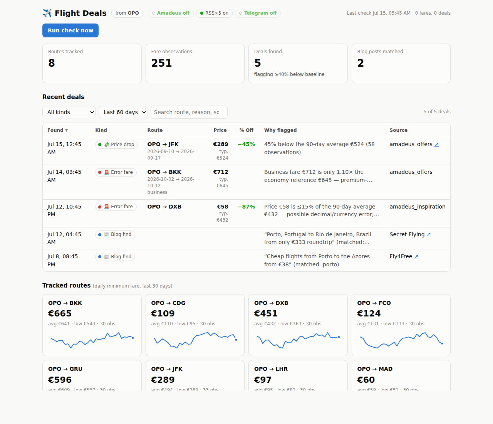
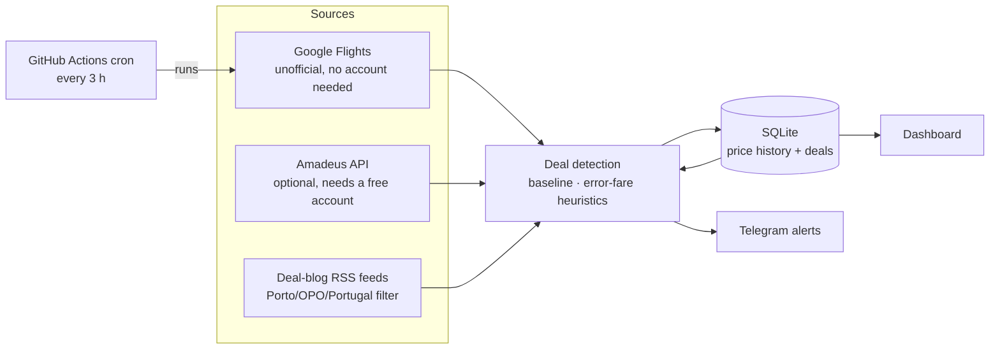

# ✈️ Porto Flight Deals

A personal flight-deal finder for departures from **Porto (OPO)** — or any
airports you configure. It combines live fare data with deal-blog RSS feeds,
learns what "normal" prices look like per route, flags price drops and
suspected **error fares**, sends **Telegram alerts**, and shows everything on
a local **dashboard**. Scheduled checks run for free on GitHub Actions.

**No paid accounts or API applications required to get started** — the
default price source needs zero signup. Keep reading for the honest tradeoff
that comes with that.



## How it works



Every check run:

1. **Collects** fares — quotes (economy *and* business) for a curated list of
   `discovery_destinations` plus your personal `watchlist` routes — and any
   new RSS posts mentioning your keywords. Every fare seen is stored, so a
   per-route price baseline builds up over time.
2. **Detects** deals against that baseline:
   - **Price drop** — fare ≥ 40 % (configurable) below the route's trailing
     90-day average. Activates once a route has 5+ observations.
   - **Error fare** — price ≤ 15 % of baseline (decimal/currency slips),
     ≥ 3 σ below the average (outliers on stable routes), or business/first
     priced ≤ 1.4× economy.
   - **Blog find** — every new matching RSS post, no price scoring.
3. **Alerts** via Telegram with route, price, dates, source link, and *why*
   it was flagged — with a cooldown so the same deal doesn't repeat every run.

## ⚠️ About the default price source — read this first

There is no flight-price API that's both free and requires zero signup —
Amadeus, Kiwi, and every other real API need at least an account. Since you
don't have (or want) an Amadeus account, the default here is the
**Google Flights collector** (`flightdeals/collectors/google_flights.py`),
built on the third-party [`fast-flights`](https://github.com/AWeirdDev/flights)
library. Know what that actually means:

- It's **not an official API** — it's an unofficial scraper, not sanctioned
  by Google's Terms of Service for automated access. This is a reasonable
  choice for a low-volume personal tool (a handful of requests every few
  hours), which is why it's built this way, but it's not risk-free.
- **It may not work from GitHub Actions.** Google actively blocks scraping
  from shared/datacenter IP ranges, which is exactly what GitHub-hosted
  runners are. It very likely works fine run locally from your home network
  and may get silently blocked when the same code runs in CI — there's no
  way to know for certain without trying it (see **Testing this yourself**
  below). If that happens, the run log will show `google_flights` errors,
  but the rest of the app keeps working: RSS "blog find" deals still get
  detected and alerted, and the dashboard still works.
- **It can break without warning** if Google changes their page markup.
- There's no "search anywhere" mode (unlike Amadeus's Flight Inspiration
  Search), so broad discovery uses a curated `discovery_destinations` list
  in `config.yaml` instead of a true open search — edit it to match
  destinations you'd actually consider.

**If you'd rather have an official, quota-backed source**, Amadeus for
Developers has a genuinely free self-service tier — see
[Optional: Amadeus](#optional-amadeus-for-developers-more-official) below.
It takes about five minutes and doesn't require a company or business use
case, just an email address.

### Testing this yourself

Before trusting it to run unattended, check whether the Google Flights
collector actually works from wherever you plan to run it:

```bash
python -m flightdeals.run --dry-run
# look for a line like: "google_flights: OPO → N fares (...)"
# any errors show up as: "error: google_flights:OPO-XXX:economy: ..."
```

If it works locally but errors out once deployed to GitHub Actions, that's
the datacenter-IP blocking described above — not a bug. RSS-based alerts
will still work fine there regardless.

## Quick start (local)

```bash
git clone <this repo> && cd <this repo>
python3 -m venv .venv && source .venv/bin/activate
pip install -r requirements.txt

cp .env.example .env     # optional — only needed for Telegram/Amadeus/Kiwi

python -m flightdeals.run --dry-run   # one check, alerts printed not sent
python -m flightdeals.dashboard       # dashboard at http://127.0.0.1:8000
```

That's it — no `.env` required at all to start collecting fares and blog
deals. Fill in `.env` (see below) when you're ready for Telegram alerts.
To preview the dashboard with realistic fake data instead of waiting for
real history to build up:

```bash
python scripts/seed_demo.py
FLIGHTDEALS_DB=data/demo.db python -m flightdeals.dashboard
```

## Getting the API keys

### Telegram bot (recommended — this is how deals reach you)

1. In Telegram, message **@BotFather** → `/newbot` → pick a name and
   username → copy the token into `.env` as `TELEGRAM_BOT_TOKEN`.
2. Send any message to your new bot (it can't message you first).
3. Run `python -m flightdeals.alerts --get-chat-id` and put the printed id
   in `.env` as `TELEGRAM_CHAT_ID`.
4. Verify with `python -m flightdeals.alerts --test-message`.

Without this, deals still get detected and stored — you just won't get
pinged, and you'd need to check the dashboard yourself.

### Optional: Amadeus for Developers (more official)

A genuinely free account, no company/business review needed for the test
tier — worth it if you want a real API instead of a scraper, or if the
Google Flights collector turns out to be unreliable from where you run this.

1. Create an account at [developers.amadeus.com](https://developers.amadeus.com).
2. *My Self-Service Workspace → Create new app* → copy the **API Key** →
   `AMADEUS_CLIENT_ID` and **API Secret** → `AMADEUS_CLIENT_SECRET` in `.env`.
3. Set `api.amadeus.enabled: true` in `config.yaml` (it stays off otherwise,
   even with keys present — this is deliberate so it doesn't switch itself
   on and start consuming quota).
4. New apps start in the **test** environment: free, but it serves limited
   cached data and small airports like OPO can return sparse or empty
   results. For real fares, request **production keys** for the app (still
   includes a free monthly request quota) and set
   `api.amadeus.environment: production`.

**Quota math** with the defaults (1 origin, every 3 h = ~240 runs/month):
each run makes ~1 inspiration call + 3 watchlist routes × 2 cabins = **~7
calls, ≈ 1 700/month**, inside the free tier. Both collectors write the same
data shape, so detection and the dashboard don't care which is active — you
can even run both at once.

### Optional: Kiwi.com Tequila (legacy)

Tequila **closed to new sign-ups in 2023**. If you already have a legacy
key, set `KIWI_API_KEY` in `.env` and `api.kiwi.enabled: true` in
`config.yaml`. Otherwise ignore it — the collector stays off. (The
pluggable collector interface in `flightdeals/collectors/base.py` makes it
easy to swap in another source, e.g. Travelpayouts, later.)

## Deployment: scheduled checks on GitHub Actions

The included workflow `.github/workflows/check-deals.yml` runs a check
every 3 hours and **commits the updated SQLite database back to the repo**,
so price history persists between runs with zero infrastructure.

1. Push this repository to GitHub.
2. Nothing else is required to enable the default Google Flights + RSS
   checks — no secrets needed.
3. Optional: *Repo → Settings → Secrets and variables → Actions* → add
   `TELEGRAM_BOT_TOKEN` / `TELEGRAM_CHAT_ID` for alerts, and
   `AMADEUS_CLIENT_ID` / `AMADEUS_CLIENT_SECRET` / `KIWI_API_KEY` if you've
   opted into those sources.
4. Merge to the **default branch** — GitHub only runs scheduled workflows
   from there.
5. Test immediately via *Actions → Check flight deals → Run workflow*
   (manual dispatch), then check the run log for `google_flights` errors
   (see the ⚠️ section above — this is the one part of the pipeline that
   might not survive the move from your machine to a hosted runner).

**Changing the frequency**: edit the `cron:` line in the workflow (GitHub
can't read `config.yaml` for scheduling; `schedule.check_every_hours` only
drives local `--loop` mode). Note GitHub may delay scheduled runs by a few
minutes, and disables schedules after ~60 days without repo activity — the
DB commits count as activity, so that rarely matters here.

**If you also run checks locally**, the CI-committed database will conflict
with your local one; either `git pull` before local runs or point local runs
elsewhere with `--db` / `FLIGHTDEALS_DB`.

## Configuration (`config.yaml`)

Everything tunable lives in one file — no code changes needed:

| Key | What it does | Default |
| --- | --- | --- |
| `origins` | Departure airports (IATA) | `[OPO]` |
| `watchlist` | Destinations that get full quotes incl. business cabin | `[JFK, GRU, BKK]` |
| `discovery_destinations` | Broad-discovery destinations (economy only) | `[MAD, CDG, FCO, LHR, AMS, BCN]` |
| `detection.discount_threshold_pct` | % below baseline that flags a deal | `40` |
| `detection.baseline_window_days` | Trailing window for "normal price" | `90` |
| `detection.min_observations` | History needed before price rules fire | `5` |
| `detection.zscore_threshold` / `decimal_error_ratio` / `premium_cabin_ratio` | Error-fare heuristics | `3.0` / `0.15` / `1.4` |
| `alerts.cooldown_hours` / `realert_drop_pct` / `max_alerts_per_run` | Alert dedupe & cap | `24` / `5` / `15` |
| `schedule.check_every_hours` | Local `--loop` cadence (Actions cron is separate) | `3` |
| `api.google_flights.*` | Default source: per-run call budgets, request delay, cache TTL | see file |
| `api.amadeus.*` (optional, `enabled: false` by default) | Environment, call budgets, search windows, cache TTL | see file |
| `rss.keywords` / `rss.feeds` / `rss.max_age_days` | Blog matching | porto/opo/portugal |
| `database.path` | SQLite location | `data/flightdeals.db` |

Secrets (`.env` locally, repository secrets on GitHub) are documented in
[.env.example](.env.example).

## CLI reference

```bash
python -m flightdeals.run                  # one check
python -m flightdeals.run --dry-run        # don't send Telegram messages
python -m flightdeals.run --loop           # run forever on the configured cadence
python -m flightdeals.run --db other.db    # use a different database
python -m flightdeals.dashboard --port 8000
python -m flightdeals.alerts --get-chat-id | --test-message
pytest                                     # run the test suite
```

## Notes on data quality & fair use

- **RSS collection is the one source that's fully within normal terms of
  use** — blog sites are read through their published feeds with a polite
  User-Agent and one request per feed per run, no scraping. If a feed URL
  stops working, the run log will show it; feeds are editable in
  `config.yaml`.
- **The Google Flights collector is a scraper, used deliberately
  conservatively**: a hard call budget per run, a delay between requests,
  and long-lived local caching, specifically to keep its footprint small.
  See the ⚠️ section above for what that does and doesn't guarantee.
- **Rate limits** — all API/scraper calls are budgeted per run, routes
  rotate (least-recently-checked first), and responses are cached locally
  so dashboard-triggered re-checks don't burn through the budget.
- **Baselines take time** — price-based detection needs
  `min_observations` data points per route (a day or two at the default
  cadence). Blog finds and the premium-cabin heuristic work from run one.
- Fares change fast; always confirm the price at booking time before
  celebrating. 🎉

## Troubleshooting

| Symptom | Likely cause |
| --- | --- |
| `google_flights` errors in the run log | Likely blocked (see ⚠️ section) — works locally? Try Amadeus instead, or accept RSS-only detection there |
| Amadeus returns empty results | Test environment has limited data for OPO — switch to production keys |
| `rss: fetch failed` in the run log | Feed URL changed or site blocks bots — update/remove it in `config.yaml` |
| No Telegram messages | Run `--test-message`; check you messaged the bot first and the chat id is right |
| No price-drop deals yet | Baseline still warming up (`min_observations`) — expected in week one |
| Scheduled workflow not running | It must be on the default branch |
